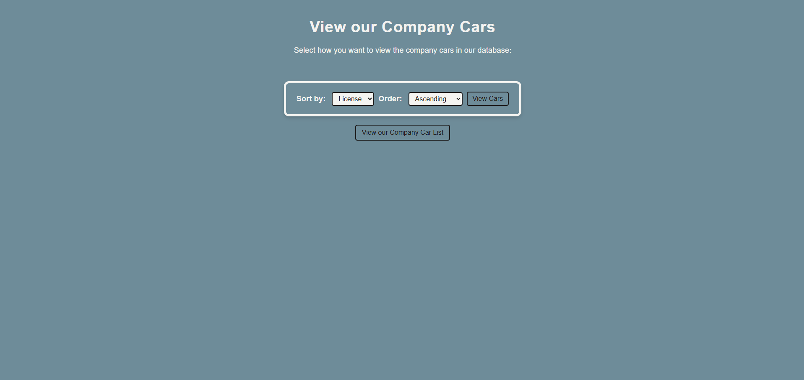
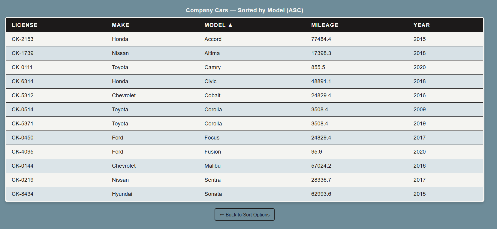
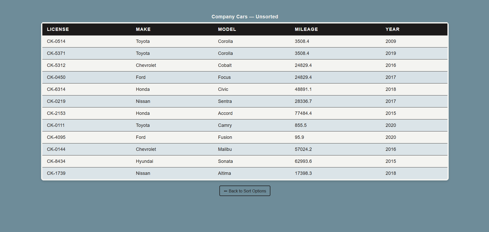

-------------------------------------------------------------
Final Project — Unit 9: Web Database I
Author: Jasmine Radi
-------------------------------------------------------------

Project Overview
----------------
This project connects to a locally hosted MySQL database and retrieves data 
from the `company_cars` table within the `vehicle_fleet` database. 

It allows users to view and sort the records by different columns such as 
Make, Model, Mileage, and Year in ascending or descending order. 
The HTML interface includes styled dropdowns and a table for clear presentation 
of the database results.

Files Included
--------------
1. cars.html  — Main user interface and form for sort options.
2. cars.php   — PHP script that connects to the database, runs the SQL query, 
                 and displays the table of results.
3. styles.css — External stylesheet for consistent visual styling.
4. vehicle_fleet.sql — Database export created manually in phpMyAdmin.
5. screenshots/ (optional folder) — Proof of the project working locally 
                 for instructors with a different database setup.

Technical Notes
---------------
• The original textbook examples used deprecated `mysql_*` functions that are 
  no longer supported in PHP 8+. All connections and queries in this project 
  use `mysqli`, which is the modern and secure alternative.

• Since the original data files for Chapter 7 were unavailable, the `vehicle_fleet`
  database and `company_cars` table were recreated manually. Sample data was 
  inserted to demonstrate full project functionality.

• Tested and verified using WAMP64, PHP 8.2, and MySQL 8 on a local environment.

Screenshots
---------------
**Form Sorting**

**Sort By Ascending**

**Default Table With No Sort**

How to Use
----------
1. Import the included `vehicle_fleet.sql` file into phpMyAdmin.
2. Open `cars.html` in your local server environment (e.g., http://localhost/practice/cars.html).
3. Choose sorting options and submit to view results dynamically in `cars.php`.
4. Styling and colors are defined in `styles.css` for a cohesive presentation.

Reflection
----------
This project required troubleshooting outdated code, recreating data files, 
and updating syntax to match current PHP standards. While the source material 
was significantly outdated, this version demonstrates a modern, functional 
approach to PHP-MySQL integration.

Thank you for reviewing my submission.
-------------------------------------------------------------
